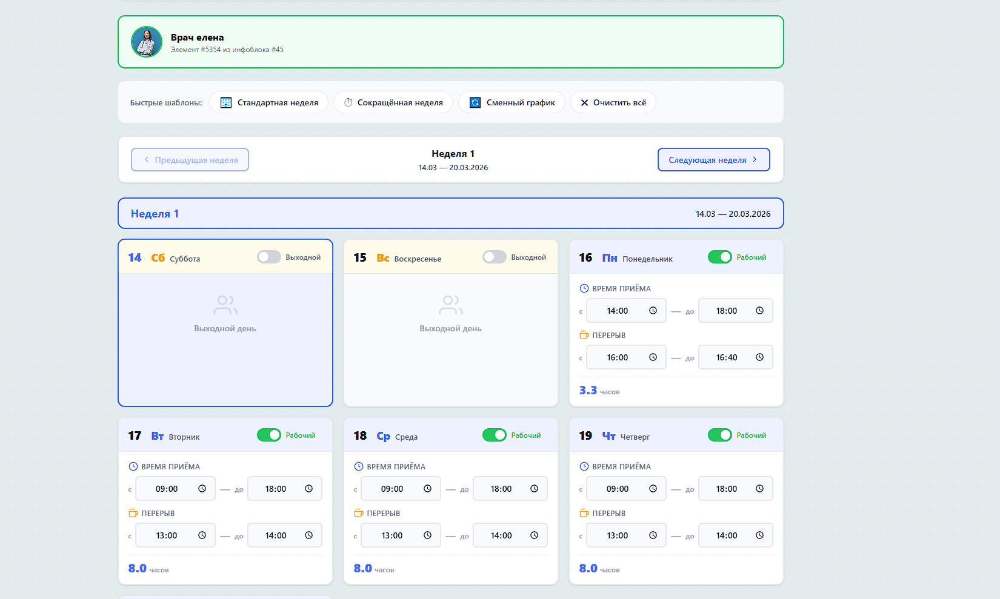
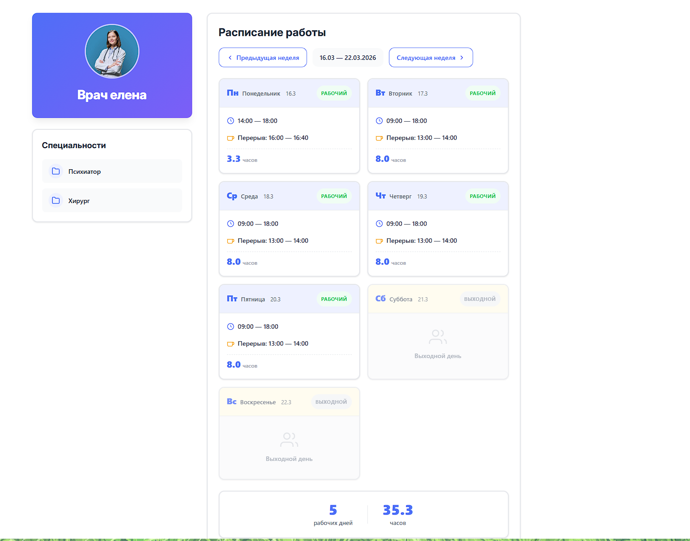
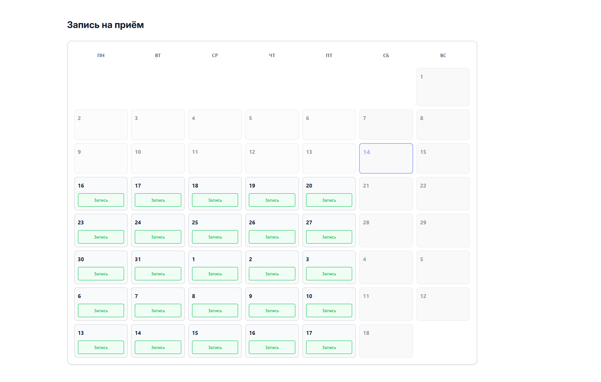

# Модуль «Расписание врачей» (testtask.schedule)

Модуль для управления рабочим расписанием врачей в Bitrix. Позволяет настраивать рабочие дни, время приёма и перерывы для каждого врача.

---

## 📸 Скриншоты

### Админ-панель


### Список врачей


### Детальная страница


---

## 📋 Быстрый старт

### 1. Установка

1. Скопируйте папку `testtask.schedule` в `/local/modules/`
2. Перейдите в админку: **Marketplace → Установленные решения**
3. Найдите модуль «Расписание врачей» и нажмите **Установить**

### 2. Создание инфоблока

1. Создайте инфоблок «Врачи» (тип — любой)
2. Добавьте элементы (врачей) с полями:
   - **Название** — ФИО врача
   - **Картинка для анонса** — фото врача (опционально)

### 3. Настройка инфоблока со специальностями (опционально)

Для работы фильтрации по специальностям:

1. Создайте инфоблок «Специальности/Кабинеты» (тип — любой)
2. Добавьте свойство типа **«Привязка к элементам»**:
   - **Код свойства:** `DOCTOR_ID` (обязательно!)
   - **Тип:** Привязка к элементам
   - **Инфоблок:** выберите инфоблок «Врачи»
   - **Множественное:** можно включить, если у врача может быть несколько специальностей
3. Добавьте элементы специальностей (например, «Терапевт», «Хирург», «Кабинет 101»)
4. В каждом элементе специальности заполните свойство `DOCTOR_ID` — выберите врачей, которым соответствует эта специальность

**В админке модуля:**
- Выберите инфоблок со специальностями
- Выберите свойство связи (код должен быть `DOCTOR_ID`)
- Настройки сохраняются автоматически

### 4. Настройка расписания (админка)

**Сервисы → Расписание врачей → Настройка расписания**

1. **Шаг 1:** Выберите инфоблок с врачами
2. **Настройки (опционально):** Выберите инфоблок со специальностями и свойство связи
3. **Шаг 2:** Выберите врача из списка
4. **Настройте расписание на 35 дней (5 недель):**
   - Календарь отображает 5 недель начиная с текущего дня
   - Прошедшие дни автоматически скрыты
   - Навигация по неделям: кнопки "Предыдущая неделя" / "Следующая неделя"
   - **Для каждого дня индивидуально:**
     - Включите/выключите рабочий день (toggle)
     - Укажите время приёма (с/до)
     - Укажите перерыв (опционально)
   - **Шаблоны расписания:**
     - 🏢 **Стандартная неделя** — Пн-Пт 09:00-18:00, перерыв 13:00-14:00
     - ⏱ **Сокращённая неделя** — Пн-Пт 09:00-15:00, без перерыва
     - 🔄 **Сменный график** — чередование рабочих и выходных дней
     - ✖ **Очистить всё** — сброс всех настроек
5. Нажмите **Сохранить расписание**

**Примечание:** 
- Настройки инфоблока со специальностями сохраняются автоматически и используются компонентом на сайте
- Каждый день настраивается индивидуально по конкретной дате, а не по дню недели
- Расписание сохраняется для конкретных дат, что позволяет создавать гибкие графики работы

---

## 🎨 Использование на сайте

### Комплексный компонент `testtask:schedule.editor`

Выводит список врачей и детальные страницы с расписанием.

#### Пример подключения

```php
<?$APPLICATION->IncludeComponent(
    'testtask:schedule.editor',
    '.default',
    [
        'IBLOCK_ID' => 5,                    // ID инфоблока с врачами
        'SEF_MODE' => 'Y',                   // Включить ЧПУ
        'SEF_FOLDER' => '/doctors/',          // Папка ЧПУ
        'SEF_URL_TEMPLATES' => [
            'list' => '',                     // Список: /doctors/
            'detail' => '#ELEMENT_ID#/',      // Деталка: /doctors/123/
        ],
        'SET_TITLE' => 'Y',                   // Устанавливать заголовок
        'CACHE_TIME' => 3600,
    ]
);?>
```

#### Режимы работы

- **Список** (`list.php`) — сетка врачей с фото и названием
  - Фильтрация по специальностям (если настроен инфоблок со специальностями)
- **Деталка** (`detail.php`) — страница врача с расписанием (только просмотр)
  - Расписание на текущую неделю с навигацией (AJAX, без перезагрузки)
  - Календарь записи на приём на месяц вперёд
  - Визуальная запись на приём (без функционала сохранения)

#### URL-структура

- Список: `/doctors/`
- деталка: `/doctors/123/` (по ID) или `/doctors/ivanov/` (по коду)

---

## 🏗️ Архитектура решения

### Структура модуля

```
testtask.schedule/
├── install/
│   ├── index.php              # Установщик (создание таблицы, копирование файлов)
│   ├── components/            # Компонент для публичной части
│   └── version.php
├── admin/
│   ├── doctor_schedule.php    # Админ-страница настройки расписания
│   ├── doctor_schedule_ajax.php # AJAX-обработчик сохранения
│   └── menu.php               # Пункт меню в админке
├── lib/
│   └── ScheduleTable.php      # ORM-сущность (D7 DataManager)
├── css/                       # Стили для админки
├── js/                        # JavaScript для админки
└── lang/                      # Локализация
```

### База данных

**Таблица:** `testtask_doctor_schedule`

| Поле | Тип | Описание |
|------|-----|----------|
| `id` | INT | Первичный ключ |
| `doctor_id` | INT | ID элемента инфоблока (врача) |
| `date` | DATE | Конкретная дата расписания (YYYY-MM-DD) |
| `is_working` | TINYINT | Рабочий день (1) / выходной (0) |
| `time_start` | VARCHAR(5) | Начало работы (HH:MM) |
| `time_end` | VARCHAR(5) | Окончание работы (HH:MM) |
| `break_start` | VARCHAR(5) | Начало перерыва (опционально) |
| `break_end` | VARCHAR(5) | Конец перерыва (опционально) |

**Уникальный ключ:** `(doctor_id, date)` — одна запись = одна конкретная дата одного врача

**Особенности:**
- Расписание хранится по конкретным датам, а не по дням недели
- Позволяет настраивать индивидуальный график для каждого дня
- Можно создавать гибкие расписания с разными графиками на разные недели

---

## 💡 Выбранный подход

### 1. **D7 ORM (DataManager)**
- Использован стандартный механизм Bitrix для работы с БД
- Типизация полей, валидация, единый API для CRUD
- Класс `ScheduleTable` наследуется от `DataManager`

### 2. **Гибкая структура БД по датам**
- Одна таблица с уникальным ключом `(doctor_id, date)`
- Расписание хранится по конкретным датам, а не по дням недели
- Метод `saveSchedule()` делает upsert (вставка или обновление) для каждой даты
- Гарантирует идемпотентность сохранения
- Позволяет настраивать индивидуальный график для каждого дня

### 3. **Разделение админки и публичной части**
- **Админка** (`/bitrix/admin/doctor_schedule.php`) — полное редактирование:
  - Календарь на 35 дней (5 недель) с навигацией
  - Индивидуальная настройка каждого дня
  - Шаблоны расписания (стандартная неделя, сокращённая, сменный график)
  - Toggle для включения/выключения рабочих дней
  - AJAX-сохранение без перезагрузки
  - Автоматический подсчёт рабочих часов
- **Публичная часть** (`testtask:schedule.editor`) — комплексный компонент по аналогии с `bitrix:news`:
  - Список врачей (фото + название) с фильтрацией по специальностям
  - Детальная страница (расписание только для просмотра):
    - Расписание на текущую неделю с AJAX-навигацией
    - Календарь записи на приём на месяц вперёд
    - Визуальная запись на приём (выбор времени, без сохранения)

### 4. **Интеграция с инфоблоками**
- Врачи = элементы инфоблока (не пользователи Bitrix)
- Гибкость: можно добавить любые свойства (специализация, кабинет и т.д.)
- Используются стандартные поля: `ID`, `NAME`, `PREVIEW_PICTURE`, `CODE`

### 5. **ЧПУ и комплексный компонент**
- Поддержка ЧПУ (как у `bitrix:news`)
- Два режима: список и деталка
- Работа по ID или символьному коду элемента

---

## 📝 API модуля

### ORM-методы

```php
use Testtask\Schedule\ScheduleTable;
use Bitrix\Main\Type\Date;

// Получить расписание врача на период
$startDate = new Date('2026-03-01', 'Y-m-d');
$endDate = new Date('2026-03-31', 'Y-m-d');
$schedule = ScheduleTable::getScheduleByDoctor($doctorId, $startDate, $endDate);
// Возвращает: ['2026-03-01' => [...], '2026-03-02' => [...], ...] (по датам)

// Сохранить расписание для конкретных дат
$result = ScheduleTable::saveSchedule($doctorId, [
    '2026-03-01' => ['is_working' => 1, 'time_start' => '09:00', 'time_end' => '18:00', ...],
    '2026-03-02' => ['is_working' => 0, ...],
    // ...
]);
```

---

## ⚙️ Параметры компонента

| Параметр | Тип | Описание |
|----------|-----|----------|
| `IBLOCK_ID` | int | ID инфоблока с врачами (обязательно) |
| `SEF_MODE` | Y/N | Включить поддержку ЧПУ |
| `SEF_FOLDER` | string | Каталог ЧПУ (например, `/doctors/`) |
| `SEF_URL_TEMPLATES` | array | Шаблоны URL для списка и детальки |
| `ELEMENT_ID` | int | ID врача (для режима без ЧПУ) |
| `SET_TITLE` | Y/N | Устанавливать заголовок страницы |
| `SET_STATUS_404` | Y/N | Устанавливать статус 404 при ошибке |
| `CACHE_TIME` | int | Время кеширования (секунды) |

---

## 🔧 Зависимости

- **Модуль `iblock`** — обязателен (для работы с инфоблоками)
- **Bitrix D7** — используется ORM

---

## 📦 Что входит в модуль

✅ Установщик с созданием таблицы БД  
✅ Админ-страница для настройки расписания:
   - Календарь на 35 дней (5 недель)
   - Индивидуальная настройка каждого дня
   - Шаблоны расписания (стандартная, сокращённая, сменный график)
   - Навигация по неделям
✅ AJAX-сохранение без перезагрузки  
✅ Комплексный компонент (список + деталка):
   - Фильтрация по специальностям
   - AJAX-переключение недель на детальной странице
   - Календарь записи на приём на месяц
   - Визуальная запись на приём (без функционала сохранения)
✅ Поддержка ЧПУ  
✅ Стили и адаптивный дизайн  
✅ Локализация (русский язык)  

---

## 🎯 Примеры использования

### Получить расписание врача в PHP

```php
use Testtask\Schedule\ScheduleTable;

$doctorId = 123;
$schedule = ScheduleTable::getScheduleByDoctor($doctorId);

foreach ($schedule as $dayNum => $dayData) {
    if ($dayData['is_working']) {
        echo "День $dayNum: {$dayData['time_start']} - {$dayData['time_end']}\n";
    }
}
```

### Проверить, работает ли врач в определённую дату

```php
use Bitrix\Main\Type\Date;

$checkDate = new Date('2026-03-15', 'Y-m-d');
$schedule = ScheduleTable::getScheduleByDoctor($doctorId, $checkDate, $checkDate);
$daySchedule = $schedule['2026-03-15'] ?? null;

if ($daySchedule && $daySchedule['is_working']) {
    echo "Врач работает 15 марта с {$daySchedule['time_start']} до {$daySchedule['time_end']}";
}
```

---

## 📞 Поддержка

Модуль создан как тестовое задание. Для вопросов и предложений обращайтесь к разработчику.

---

**Версия:** 1.0.0  
**Дата:** 2026-03-12  
**Лицензия:** Собственная
